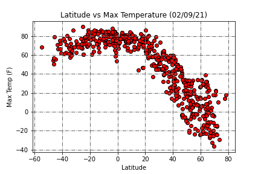
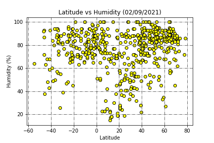
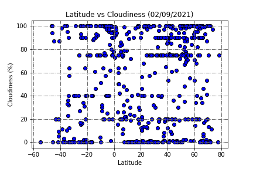
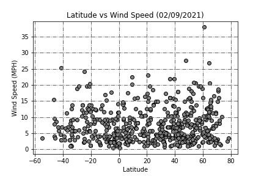

# PythonAPIs

***
Whether financial, political, or social -- data's true power lies in its ability to answer questions definitively. So let's take what you've learned about Python requests, APIs, and JSON traversals to answer a fundamental question: "What's the weather like as we approach the equator?"

Now, we know what you may be thinking: _"Duh. It gets hotter..."_

But, if pressed, how would you **prove** it?

## Part 1 : WeatherPy

You'll be creating a Python script to visualize the weather of 500+ cities across the world of varying distance from the equator. To accomplish this, you'll be utilizing a simple Python library, the OpenWeatherMap API, and a little common sense to create a representative model of weather across world cities.

The first requirement is to create a series of scatter plots to showcase the following relationships:

* Temperature (F) vs. Latitude

This graph shows the max temperatures peak near, or at, the equator while dropping steadily as you move away in either direction.

* Humidity (%) vs. Latitude
  
 

Without doing a deeper analysis, the graph alone doesn't clearly indicate a correlation between humidity and latitude. Especially with the various countries plotted near a very low humidity and near the equator. I would prefer to further analyze this, rather than speculate by viewing just this graph. 

* Cloudiness (%) vs. Latitude

There seems to be a slight correlation of cloud cover. The interesting observation one could further investigate are the dense data surrounding the 0%, 20%, 40%, 75%, 90% and 100% markers. It would be interesting to see what aspects of the dataset could determine why these countries have more cloud coverage.

* Wind Speed (mph) vs. Latitude

This graph does not clearly indicate any correlation between latitude location and wind speed. Depending on weather events, this data could always be slightly skewed. If one compared this data set with severe weather events, it's possible to find interesting facts or indicators. 

## Part II : VacationPy

Now let's use your skills in working with weather data to plan future vacations. Use jupyter-gmaps and the Google Places API for this part of the assignment.

1. Create a heat map that displays the humidity for every city from Part I. (**Screenshot below**)

2. Plot the hotels on top of the humidity heatmap with each pin containing the Hotel Name, City, and Country.

